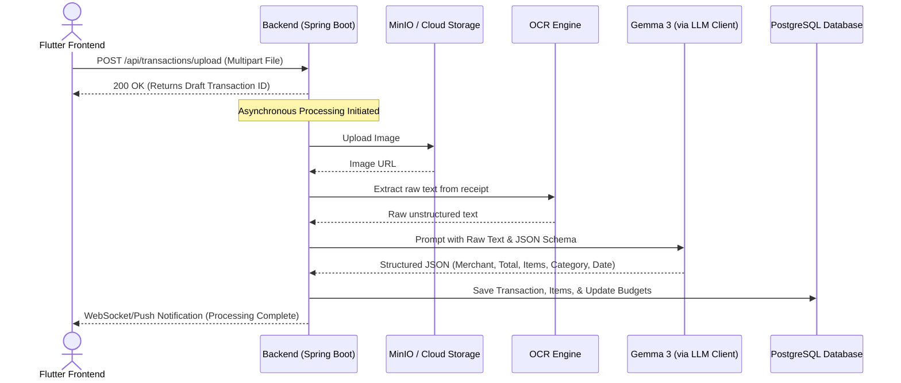

# Recipe Wallet: Technical & Business Specification Document

## 1. Executive Summary & Value Proposition
**Recipe Wallet** is a next-generation personal finance and budgeting platform designed to bridge the gap between daily consumer spending and detailed, itemized budgeting. Unlike traditional budgeting apps that only track total transaction amounts, Recipe Wallet leverages advanced Optical Character Recognition (OCR) and Large Language Models (LLMs) (such as Gemma 3) to digest receipt images, automatically extract line-by-line itemizations, categorize expenses, and match them with active user budgets.

### The Problem
* **Manual Data Entry Friction:** Users find manual expense logging tedious, leading to low retention and incomplete financial datasets.
* **Lacking Granularity:** Bank syncs only show the merchant name and total dollar amount (e.g., "$120 at Costco"). They fail to capture *what* was bought (e.g., how much was spent on groceries vs. household goods vs. electronics).
* **Missed Budget Optimization:** Traditional apps cannot tell you if you are spending too much on specific ingredients or items, nor can they assist in connecting purchases to lifestyle habits (e.g., meal prep or recipe planning).

### The Solution: Recipe Wallet
1. **Snap & Track:** Upload receipt photos for automated, itemized expense extraction in under 5 seconds.
2. **Item-Level Granularity:** Track grocery items, cafe bills, transport costs, and utility line-items independently.
3. **Smart Budgeting:** Dynamically adjust spending limits and auto-update budgets based on actual categorized purchases.
4. **Context-Aware Analytics:** Bridge the gap between grocery spending and recipe planning/food waste reduction.

---

## 2. Business Use Cases
Here are the primary business use cases for the Recipe Wallet application:

### Use Case 1: Automated Receipt Processing & Micro-Budget Tracking
* **Description:** A user takes a photo of a supermarket receipt. The app extracts individual items, classifies them, and logs the transaction.
* **Business Value:** Dramatically increases user engagement by eliminating data-entry fatigue. It enables highly targeted budgeting at the micro-level (e.g., tracking the cost of coffee beans specifically rather than general "groceries").

### Use Case 2: Grocery-to-Recipe Optimization (The "Recipe" Synergy)
* **Description:** The system analyzes grocery items from scanned receipts to suggest recipes, meal plans, or shopping lists. It tracks ingredient prices over time to calculate the exact cost per meal.
* **Business Value:** Provides a unique selling point (USP) that differentiates Recipe Wallet from general budget apps (e.g., Mint, Copilot, Monarch). Connects financial management with household utility.

### Use Case 3: Expense Splitting & Shared Household Budgets
* **Description:** Roommates or couples scan shared receipts, select specific line items they want to split, and instantly send payment links or update a shared balance book.
* **Business Value:** Taps into viral loops and network effects. One user invites others to split bills, driving organic user acquisition.

### Use Case 4: Smart Consumer Insights & Price Comparison
* **Description:** The app aggregates historical purchase data of specific items across multiple merchants, alerting users to cheaper local alternatives or price inflation trends.
* **Business Value:** B2B monetization opportunities via targeted local deals, coupons, and grocery retailer partnerships without violating user privacy.

---

## 3. System Architecture & Information Flow
To deliver these use cases, the system processes receipt uploads through a scalable backend pipeline:

---

## 4. Functional Requirements (FRs)

### 4.1. Authentication & User Management
* **FR-1.1:** The system MUST support user registration and secure login via Firebase Authentication.
* **FR-1.2:** The system MUST manage user sessions and securely pass JWT/Firebase tokens on all API requests.

### 4.3. Receipt Scanner & OCR Integration
* **FR-2.1:** The system MUST allow users to capture receipt images using the device camera or upload them from the gallery.
* **FR-2.2:** The system MUST support uploading receipt images in JPEG and PNG formats up to 10MB.
* **FR-2.3:** The backend MUST extract raw text from uploaded images using an OCR Engine.
* **FR-2.4:** The backend MUST store raw OCR texts linked to transactions for auditing and reprocessing.

### 4.4. LLM-Powered Structured Data Extraction
* **FR-3.1:** The backend MUST process raw OCR text using a Large Language Model (Gemma 3 or equivalent) to produce a structured JSON output.
* **FR-3.2:** The extracted structure MUST contain the following fields:
  * Merchant Name (String)
  * Merchant Address (String, optional)
  * Total Transaction Amount (Double)
  * Category (Enum: Cafes & Dining, Groceries, Transport, Entertainment, Shopping, Bills & Utilities, Other)
  * Itemized List (Array of Objects containing: name, price, qty)
  * Transaction Date (ISO-8601 String, defaults to current time if missing)
* **FR-3.3:** The system MUST handle LLM parsing failures gracefully, marking the transaction as "Processing Failed" so the user can edit or upload again.

### 4.5. Budgeting & Financial Tracking
* **FR-4.1:** Users MUST be able to create monthly budgets for specific categories.
* **FR-4.2:** The system MUST automatically update the "current spent" amount of a budget when a new transaction is logged or parsed in that category.
* **FR-4.3:** The system MUST recalculate budget spent balances if a transaction is edited or deleted.
* **FR-4.4:** Users MUST be able to manually create, edit, or delete transactions if they choose not to use the receipt scanner.

### 4.6. Reporting & Analytics
* **FR-5.1:** The system MUST provide visual charts (e.g., Pie charts, Bar charts) showing spending distribution by category.
* **FR-5.2:** The system MUST show line-item level spending history, allowing users to search for specific items (e.g., "Milk") across historical receipts.
