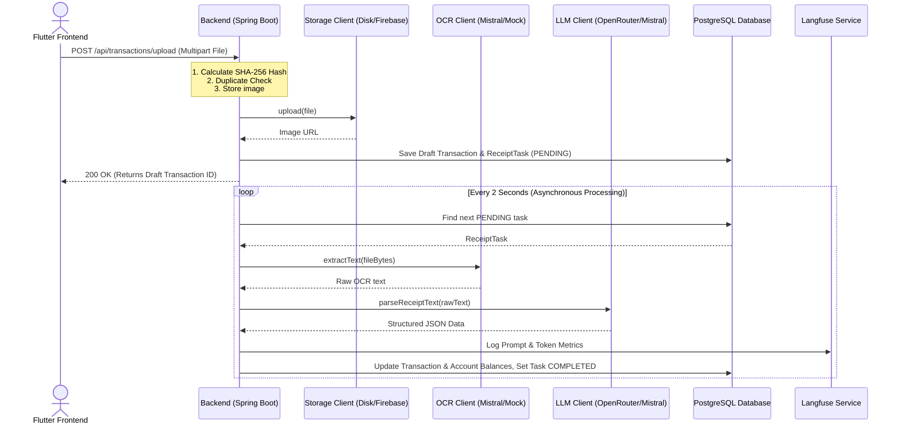
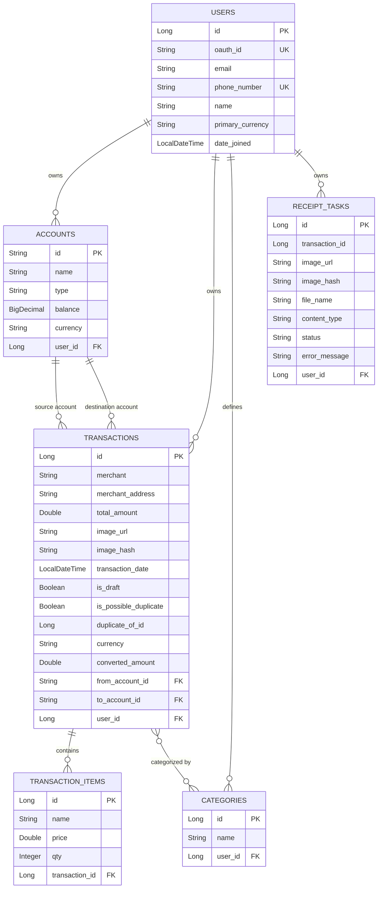

# Backend Architecture - Recipe Wallet

The Recipe Wallet backend is a robust Java application built on top of **Spring Boot 3.x**, utilizing **PostgreSQL** for persistence, **Firebase** for cloud authentication and storage, and AI providers (such as **Mistral** and **OpenRouter**) for receipt processing.

---

## 1. System Components & Flow

The backend handles receipt processing asynchronously to provide a responsive interface to the user. The pipeline consists of:
1. **API Controller**: Receives the multipart file, saves it, records a draft transaction and a pending task, and instantly returns a confirmation.
2. **Task Queue & Worker**: A background worker (`ReceiptTaskWorker`) polls pending tasks, retrieves file bytes, and initiates OCR and LLM extraction.
3. **OCR Engine**: Extracts raw text from the image.
4. **Structured LLM Parser**: Sends the raw text along with a strict JSON schema prompt to an LLM (Gemma 3 or Mistral) to retrieve structured transaction data.
5. **Langfuse Tracing**: Captures telemetry, prompt versions, latency, and tokens of the LLM pipeline for monitoring and quality checks.

---

## 2. Core Database Schema & Entities

The system model uses standard JPA annotations mapping to the PostgreSQL database.

### Entity Details

* **`User`**: Linked to Firebase authentication through `oauthId` (matching the sub-claim).
* **`Account`**: Represents user accounts/wallets (Cash, Credit Card, Bank). Tracks balances in real-time.
* **`Transaction`**: The primary financial record. Can represent drafts (created during scanning), standard expenses, incomes, or transfers (using `fromAccount` and `toAccount`).
* **`TransactionItem`**: Line items extracted from the receipt (e.g., "Organic Milk - Qty 2 - Price $3.49").
* **`Category`**: Tracks budget groups (e.g., Groceries, Transport, Bills).
* **`ReceiptTask`**: Keeps track of background processing queue tasks and status codes (`PENDING`, `PROCESSING`, `COMPLETED`, `FAILED`).

---

## 3. Asynchronous Task Worker

Background processing is executed by [ReceiptTaskWorker](../backend/src/main/java/com/recipewallet/backend/service/queue/ReceiptTaskWorker.java):
* Runs periodically every `2000ms` using Spring's `@Scheduled` annotation.
* Resolves image files locally (if stored on local disk) or downloads them.
* Invokes `performOcrAndLlm` for external OCR and LLM processing.
* Safely updates transaction states and account balances in a transaction-safe manner via `ReceiptProcessingService`.

---

## 4. API Documentation (REST endpoints)

All controller API endpoints are defined in `com.recipewallet.backend.controller`.

> [!TIP]
> A live interactive API reference is available at **[Swagger UI Documentation](https://api.velora-community.uz/swagger-ui/index.html#/transaction-controller/getTransactions)**.

### Authentication
* All routes except `/api/auth/**` require a valid Firebase Auth bearer token passed in the `Authorization` header.

### Transactions (`/api/transactions`)
* `GET /api/transactions` - List all transactions for the authenticated user.
* `GET /api/transactions/{id}` - Fetch single transaction details.
* `POST /api/transactions/upload` - Upload a receipt image (Multipart Form) for OCR/LLM scanning. Creates a draft transaction.
* `POST /api/transactions/upload-batch` - Upload multiple receipt images.
* `POST /api/transactions/manual` - Create a manual transaction (without OCR scanning).
* `PUT /api/transactions/{id}` - Update a transaction (updates total, items, and corrects account balances).
* `DELETE /api/transactions/{id}` - Delete a transaction and reverse its balance effects on accounts.
* `POST /api/transactions/{id}/keep-both` - Resolves duplicate detection warnings.

### Accounts (`/api/accounts`)
* `GET /api/accounts` - List all accounts for user.
* `POST /api/accounts` - Create new account (Cash, Card, Investment, etc.).
* `PUT /api/accounts/{id}` - Update account details/balances.
* `DELETE /api/accounts/{id}` - Remove account.

### Currencies (`/api/currencies`)
* `GET /api/currencies/rates` - Get active currency exchange rates.
* `POST /api/currencies/sync` - Manually sync current exchange rates using external Currency APIs.

---

## 5. Main Configurations & Properties

Configurations are located in [application.properties](../backend/src/main/resources/application.properties) and can be customized via environment variables:

| Property | Env Variable | Default | Description |
|---|---|---|---|
| `spring.datasource.url` | `SPRING_DATASOURCE_URL` | `jdbc:postgresql://localhost:5433/walletdb` | Database JDBC URL |
| `recipewallet.ocr.provider` | `RECIPEWALLET_OCR_PROVIDER` | `mistral` | OCR Engine (`mistral`, `mock`) |
| `recipewallet.llm.provider` | `RECIPEWALLET_LLM_PROVIDER` | `openrouter` | LLM API Client (`openrouter`, `mistral`, `mock`) |
| `recipewallet.llm.model` | `RECIPEWALLET_LLM_MODEL` | `google/gemma-3-27b-it` | Prompt model for extraction |
| `recipewallet.storage.provider` | `RECIPEWALLET_STORAGE_PROVIDER` | `disk` | Storage for images (`disk`, `firebase`, `mock`) |
| `recipewallet.app.mode` | `RECIPEWALLET_APP_MODE` | `dev` | Mode (`dev`, `prod`). `prod` disables mocks. |
| `LANGFUSE_BASE_URL` | `LANGFUSE_BASE_URL` | `http://localhost:3000` | Tracing server URL |
