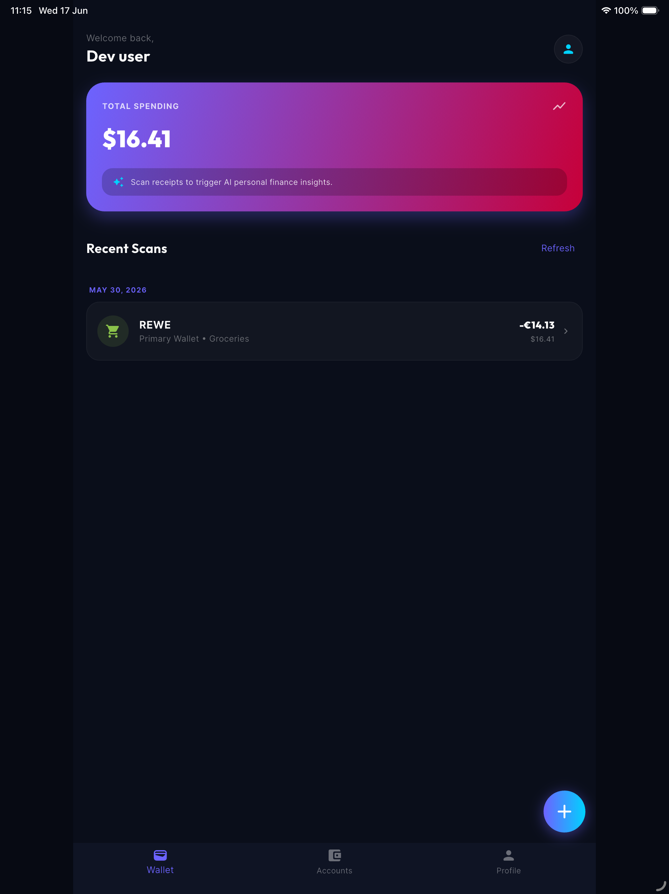
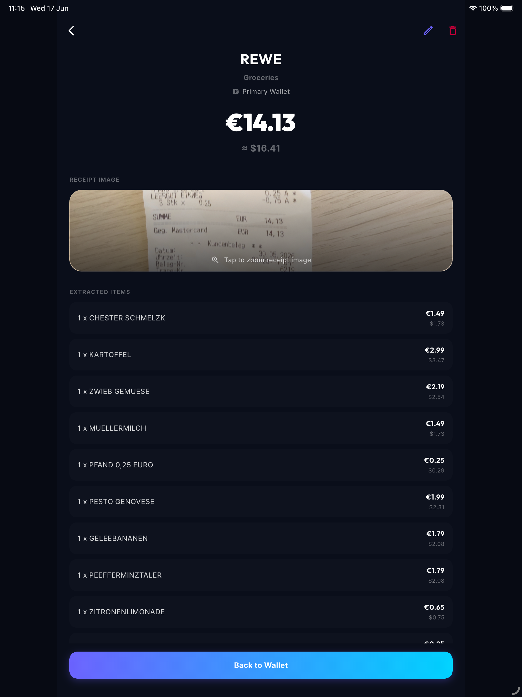

# Frontend Guide - Recipe Wallet

The Recipe Wallet frontend is a cross-platform client developed with **Flutter (Dart)** targeting iOS, Android, and Web platforms. It is styled with a futuristic, glassmorphic dark-theme design (codenamed "Neo Wallet").

---

## 1. Project Directory Structure

All frontend source files reside inside [frontend/lib](file:///Users/azamkhon/.gemini/antigravity/scratch/recipe_wallet_app/frontend/lib).

```
frontend/lib/
├── firebase_options.dart         # Platform-specific Firebase settings
├── main.dart                      # Application entry point & provider bootstrapping
├── l10n/                          # Multi-language translations
│   ├── app_localizations.dart
│   ├── strings_en.dart
│   ├── strings_ru.dart
│   ├── strings_uz.dart
│   └── strings_uz_cyrl.dart
├── screens/                       # User interfaces
│   ├── home_screen.dart           # Core bottom-navigation container
│   ├── login_screen.dart          # Authentication page
│   ├── scanner_screen.dart        # Camera and image scanning screen
│   ├── statistics_screen.dart     # Charts and analytics dashboard
│   ├── accounts_screen.dart       # Account list and card views
│   ├── profile_screen.dart        # Settings and user configuration
│   └── transaction_details_screen.dart # Breakdown of single receipt items
├── services/                      # Business logic & API communication
│   ├── api_service.dart           # REST Client for Spring Boot backend
│   ├── auth_service.dart          # Wrapper around Firebase Authentication
│   └── locale_provider.dart       # Language state management
└── widgets/                       # Reusable UI elements
    ├── glass_card.dart            # Glassmorphic backdrop wrapper
    ├── gradient_button.dart       # Vibrant action triggers
    └── section_header.dart        # Section header headings
```

---

## 2. Tech Stack & Dependencies

The client leverages a lightweight and modern set of packages configured in `pubspec.yaml`:
* **State Management**: `provider` pattern, binding authentication (`AuthService`) and localized state (`LocaleProvider`) to the widget tree.
* **REST client**: `http` & `http_parser` for handling structured API requests and multi-part file payloads.
* **Firebase core**: `firebase_core` & `firebase_auth` managing Google Sign-In and secure session storage.
* **Charts & Visuals**: `fl_chart` for displaying sleek, interactive categories pie charts.
* **Typography**: `google_fonts` configured to use the **Inter** font family.
* **Caching**: `shared_preferences` to persist local settings (e.g., Uzbek vs. English locale).

---

## 3. UI Design System & Styling

The frontend utilizes a dark-mode palette:
* **Background Color**: Deep dark space blue `0xFF070A13`
* **Surface Card Color**: Dark translucent blue `0xFF101424`
* **Primary Accent**: Neon Purple `0xFF6C63FF`
* **Secondary Accent**: Electric Cyan `0xFF00D2FF`
* **Typography**: Modern, sans-serif *Inter* styling.

### App Screen Visuals

| Main Dashboard | Receipt Extraction Detail |
|:---:|:---:|
|  |  |

### UI Enhancements
* **Glassmorphic Cards**: Implemented via [glass_card.dart](file:///Users/azamkhon/.gemini/antigravity/scratch/recipe_wallet_app/frontend/lib/widgets/glass_card.dart) utilizing Flutter's `BackdropFilter` to apply a Gaussian blur to components beneath card panels.
* **Dynamic Width Adaptation**: On screens wider than `800px` (e.g., when run on a desktop web browser), the interface automatically wraps its layout within a central column constrained to a maximum width of `800px` for optimal readability.

---

## 4. Multi-Language Support (Localization)

Supported locales are registered in `LocaleProvider` and loaded dynamically:
1. **English** (`en`)
2. **Russian** (`ru`)
3. **Uzbek Latin** (`uz`)
4. **Uzbek Cyrillic** (`uz_cyrl`)

The system translates string titles (buttons, charts, categories) automatically depending on the device environment or settings selected on the **Profile Screen**.

---

## 5. Development & Configuration Setup

The frontend reads configurations dynamically based on target build types using `flutter_dotenv`:

* **Development (`.env.development`)**: Base API url used when running debug mode locally.
* **Production (`.env.production`)**: Backend base API url used in release builds.

Currently, both target files default to:
`API_BASE_URL=https://api.velora-community.uz`
For local emulator testing, fallback behaviors are coded into `ApiService`:
* **Android Emulator**: Resolves to standard localhost proxy `http://10.0.2.2:8080`.
* **iOS Simulator / macOS / Web**: Resolves to local backend `http://localhost:8080`.
